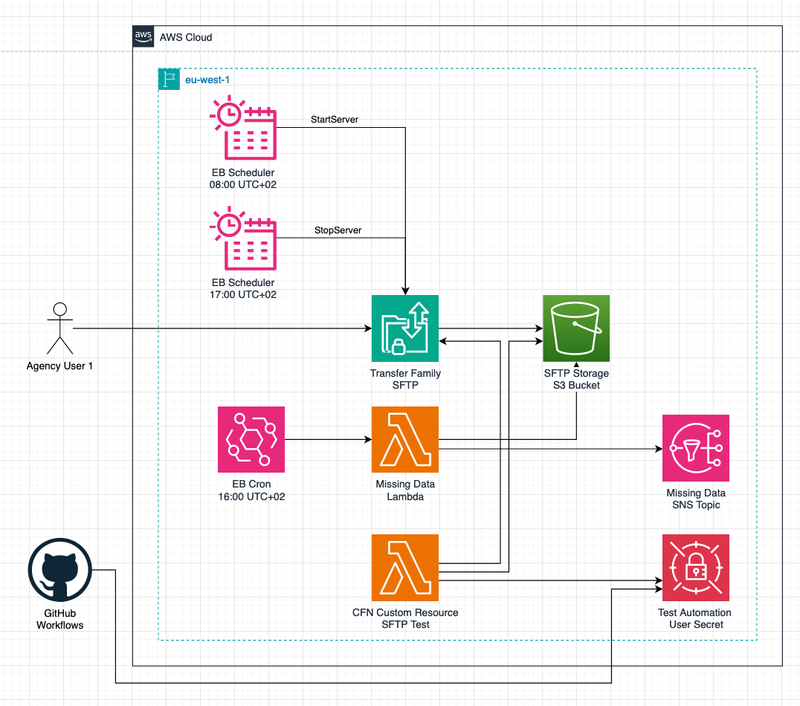
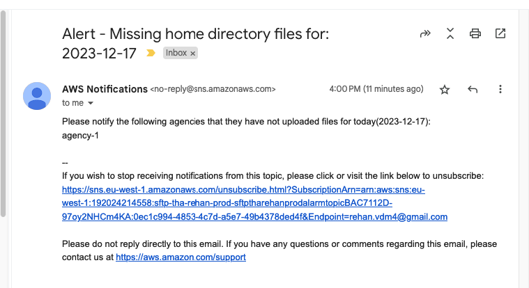

# SFTP Test

- [SFTP Test](#sftp-test)
    * [Architecture](#architecture)
    * [Assumptions](#assumptions)
        + [Upload window](#upload-window)
        + [Folder Structure](#folder-structure)
    * [Creating new Agency Users](#creating-new-agency-users)
        + [1. Create Keys](#1-create-keys)
        + [2. Update the config file](#2-update-the-config-file)
        + [3. Deploy](#3-deploy)
    * [Contributing](#contributing)
    * [Cost](#cost)
    * [Tests](#tests)
    * [Deployment Pipeline](#deployment-pipeline)
    * [Other](#other)

## Architecture



This project consists of a fairly standard CDK application that deploys:
- A Transfer Family server that accepts SFTP protocol connections.
- An S3 Bucket that stores the files uploaded by the agencies using the Transfer Family server.
- A CDK/CloudFormation Custom Resource that uses a Test user to verify that it can connect over SFTP and create a file.
It also checks that it can not get a file in another user's directory. If these tests fail, the deployment will fail
and rollback. This ensures that there is no incorrect configuration even though the deployment succeeds. It surfaces 
any errors at deploy time instead of runtime/when the agency users try to upload.
- A Lambda function that runs at 16:00 UTC+02 and checks that each agent has uploaded at least 1 file for that day
(see `Folder Structure`). If they have not, it will send an email (SNS) to the address as specified in the `config/index.ts` 
file `config.[<ENV>].alertMissingDataEmail` property. This is a basic email and looks like this:

- Two EventBridge Schedules that start the Server at 08:00 UTC+02 and stop it at 17:00 UTC+02. There is 1 hour from 
when the developer is alarmed(16:00) that an agency has not uploaded for that day, to when the server is stopped(17:00). The developer
must make contact with the client during this period. If the client has not uploaded by 17:00 UTC+02, the server will be
stopped but can be manually started again or the stop schedule can be disabled for that day.
- CloudWatch Alarms for the Missing Data Lambda and the Schedule DLQs so that we know if they do not run as expected.

## Assumptions 

### Upload window 

All 21 agencies spread across the 6 AWS regions are roughly in the same timezone of UTC+02. 
Therefore, the SFTP Server has an upload window of 08:00 - 17:00 UTC+02 and all agencies will upload their documents 
during this time. The server is stopped outside of this window to save costs. 

### Folder Structure

The folder structure in S3 is as follows:
```
├── agency-1
│   ├── 2023-12-17
│   │   ├── file1.txt
│   │   ├── file2.txt
│   ├── 2023-12-18
│   │   ├── file1.txt
├── agency-2
│   ├── 2023-12-17
│   │   ├── file1.txt
│   ├── 2023-12-18
│   │   ├── file1.txt
```

The agencies are instructed to upload their files in their home folders with the date as the name. This has two purposes:
- Creates a folder structure that is easy to navigate and understand.
- Allows the Missing Data Lambda to easily check that the agency has uploaded at least 1 file for that day.

Nothing enforces the date folder, but the agencies are instructed to do so. This can be an area of future improvement.

## Creating new Agency Users

The following steps are required to create a new agency user. In the following instructions we create a new
`agency_1` user as an example, use the appropriate agency name for your use case.

### 1. Create Keys
Communicate to the client to run the following command to create a new private and public key pair:
```bash
ssh-keygen -t rsa -b 4096 -f agency_1
```

If the client is not technically inclined, you can run the command for them and send them the private key file over 
a secure channel. 

You will now have two files: `agency_1` (private key) and `agency_1.pub` (public key). Place the public key in
the `/config/sftp-user-public-keys` folder. Instruct them to keep the private key file in a secure location.

### 2. Update the config file
Then add the user to the `agencyUsers` property in the `config/index.ts` file for the `prod` environment:
```ts
...
export const configs: Record<Environment, Config> = {
  dev: { ... },
  prod: {
    ...
    agencyUsers: [
      {
        username: 'agency-1',
        homeDirectory: 'agency-1',
        publicKey: getFile('./sftp-user-public-keys/agency_1.pub')
      }
    ],
...
}
...
```

### 3. Deploy
Commit the changes to a feature branch, make a PR and merge to `main`. The changes will be automatically deployed to
the production environment.

## Contributing

1. Prerequisites
  - NodeJS 18.x
  - AWS environment with credentials configured, local commands use an AWS_PROFILE
  - AWS account that has been CDK Bootstrapped
1. Install dependencies
   ```bash
   npm install
   ```
1. Get the test automation user private key from the AWS Secrets Manager (or ask a colleague) and place it in the 
   `private-keys` folder with the name `test_automation`. Alternatively, amend the config file to point to the correct
    location and value if you want to change this.
1. Check the configuration in `config/index.ts` and make sure that the environment you are targeting is configured correctly.
   The `dev` environment is used in local commands and tests by default.
1. The `package.json` has scripts to do CDK diffs and deployments as well as run tests.
   ```bash
   npm run dev-diff-local
   npm run dev-deploy-local
   npm run test
   ```

## Cost

The following is a rough estimate of the cost for this solution. Based in the eu-west-1 region. The services that are 
the biggest contributors to costs are: 

1. Transfer Family Server
   - $0.30 per hour
   - $0.04 per GB data uploaded
1. S3 Bucket
    - $0.023 per GB

With the following **worst-case** assumptions:
- The server is running for 9 hours per day (between 08:00 to 17:00), 7 days a week.
- An agency uploads 1.2GB (the largest file is 50MB and they upload 24) of data per day. Given that there are 21 agencies, 
  this is 25.2GB per day.

The rough cost estimate **per month** is:
- Transfer Family Server: $0.30 * 9 * 30 = $81
- Transfer Family Data: $0.04 * 25.2 * 30 = $30.24
- S3 Bucket: $0.023 * 25.2 = $0.58
- Total: $111.82

The other service costs are negligible at this scale compared to the main contributors.

> NOTE: The cost for leaving the infra running for 7 days with no uploads is $0.30 * 9 * 7 = $18.9

## Tests

This project contains unit tests that are meant to be run locally against deployed AWS resources. These tests are in
the `test` folder and will require the correct configuration in the `config/index.ts` file and 
`config.[<ENV>].testOptions` property. 

There are currently 2 tests:
- `test-sftp-connection.test.ts` - This is a unit test for the CloudFormation/CDK Custom Resource test that checks
if the test automation user can connect to the SFTP server and that it can create a file. It also checks that the 
test user can not get a file in another user's directory.
- `test-missing-data-lambda.test.ts` - This is a unit test for the Missing Data Lambda. It checks each agency folder
for the current date and checks that there is at least 1 file. If there is not, it will send an email using SNS.

## Deployment Pipeline 

This project uses GitHub Workflows. There are two workflows:
- `prod_diff.yml` - This workflow runs on every pull request to `main` and will do a CDK diff against the production 
environment.
- `prod_deploy.yml` - This workflow runs on every push to `main` and will do a CDK deploy against the production environment.

The project is configured to store the following secrets:
- `AWS_ACCESS_KEY_ID` - The AWS Access Key ID for the IAM user that has permissions to deploy to the production environment.
- `AWS_SECRET_ACCESS_KEY` - The AWS Secret Access Key for the IAM user that has permissions to deploy to the production environment.
- `TEST_AUTOMATION_PRIVATE_KEY_VALUE` - The private key value for the test automation user. This is the value of the 
  private key file as defined in `private-keys/test_automation`. 

Setting up OIDC between AWS and GitHub is out of scope for this project, see the Other section. There are also lots of 
other improvements that can be made but were left out due to time constraints. These include the `dev` environment 
workflows, required checks before merging, versioning, etc. Also note that the current setup can/should be able to 
accommodate GitFlow, but this was not tested.

## Other

- There is some manual resource creation(ClickOps) that had to be done, but they were kept to a minimum:
  - Created AWS Credentials for my IAM user to use in GitHub. They are placed in secure storage, in GH Secrets. This is 
    not ideal, but setting up OIDC between GitHub and AWS is out of scope and will create more manual clicks.
  - The test automation private key is stored as a secret in the AWS Secrets Manager. This happens before the CDK 
    stack definition and can be seen in the `createTestAutomationSecret` function in `bin/sftp-test.ts` file. This 
    is required because the SFTP Custom Resource Test Lambda requires the private key to connect to the SFTP server 
    and run tests. We do not commit the private key, nor do we represent it in plain text format in the CDK/CFN as that
    is not secure and plaintext visible. 
  - The AWS CDK Bootstrap stack was created from my local machine.
- The `dev` environment is configured to deploy to my personal AWS account and was used for testing. Only once all was 
done and working, was the `prod` environment configured and entirely deployed from GitHub (see the PRs and Action Runs).
- A domain can be specified for the Transfer Family Server, the configuration can be seen in the `dev` environment. Due
to time constraints and the fact that there is no Hosted Zone that already exists in this account, it was not added to 
the `prod` environment.
- Due to time constraints:
  - Linting and formatting was not added.
  - Only basic alarms were created, dashboard and more advanced observability was not added.
  - I could not address the "latency for upload can be an issue" requirement and also stay within the budget. One 
    solution that comes to mind is to use Route 53 Latency Based Routing to route the agencies to the closest region.
    Then deploy this solution to multiple regions (basically just a for loop over the stacks) and then use S3 Bucket
    Replication to replicate the data to a central region for use by us. This will however increase the cost
    significantly.

